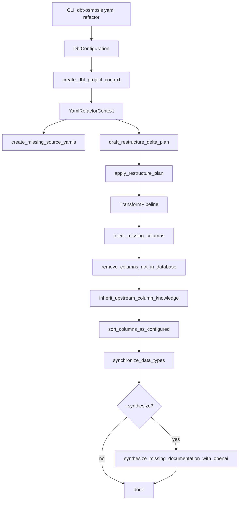
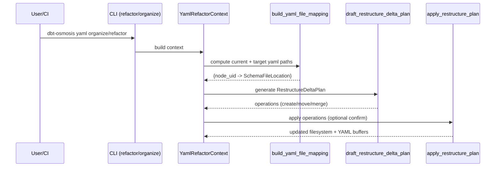

# dbt-osmosis (fork: `sparodi63/dbt-osmosis`) — Technical Documentation

This documentation describes the behavior and internal architecture of **dbt-osmosis** as implemented in the Python package distribution (v1.1.17), which matches the upstream project structure under `src/dbt_osmosis/` and is typically what forks (including yours) carry forward. :contentReference[oaicite:0]{index=0}

---

## 1. What dbt-osmosis does

**dbt-osmosis** is a developer utility that automates the “boring but necessary” work around **dbt schema YAML files**:

1. **Organize** schema YAML files into a predictable structure driven by your `dbt_project.yml` configuration.
2. **Generate / scaffold** missing YAML files for models (and sources) when they don’t exist.
3. **Sync columns** between YAML and the warehouse schema (or `catalog.json`), adding missing columns and removing columns that no longer exist.
4. **Propagate documentation** (column descriptions, tags, selected meta keys) downstream from upstream models/sources to reduce repeated manual docs work.
5. Optional: **Synthesize missing documentation** via OpenAI (if enabled).
6. Provide a **Streamlit workbench** for compiling/running dbt Jinja SQL in an interactive UI.

The public-facing entry points are a **CLI** (Click-based) and a **workbench** command. :contentReference[oaicite:1]{index=1}

---

## 2. Repository layout (package)

Under `src/dbt_osmosis/` the package is organized like this:

- `dbt_osmosis/cli/main.py`
    - CLI command group definitions (`dbt-osmosis yaml ...`, `dbt-osmosis workbench`, `dbt-osmosis sql ...`)
- `dbt_osmosis/core/osmosis.py`
    - The “engine”: dbt project context loading, YAML mapping, restructure planning, and transform pipeline operations.
- `dbt_osmosis/core/llm.py`
    - OpenAI integration to synthesize missing descriptions (optional).
- `dbt_osmosis/core/logger.py`
    - Logging helpers (Rich-style emoji/status logging).
- `dbt_osmosis/sql/proxy.py`
    - A lightweight “session” abstraction around compiling/executing SQL via dbt adapter.
- `dbt_osmosis/workbench/app.py`
    - Streamlit application logic (compile, run query, profiling report, etc.).

(Upstream repo also ships docs and examples; the fork usually preserves the same core package layout.) :contentReference[oaicite:2]{index=2}

---

## 3. High-level user workflows

### 3.1 CLI commands overview

The README and docs site describe these core commands:

- `dbt-osmosis yaml refactor`
    - Composite workflow: organize → reparse → document, plus schema/YAML synchronization.
- `dbt-osmosis yaml organize`
    - Only restructure/move/merge YAMLs and scaffold missing YAMLs (no doc propagation).
- `dbt-osmosis yaml document`
    - Only propagate documentation (no YAML restructuring).
- `dbt-osmosis workbench`
    - Start Streamlit UI for compilation/execution/profiling.
- `dbt-osmosis sql ...`
    - Helpers around compilation/execution use cases.

:contentReference[oaicite:3]{index=3}

---

## 4. Core concepts and architecture

### 4.1 Key data structures

### `DbtConfiguration`

A small configuration object used to bootstrap dbt runtime context:

- `project_dir`
- `profiles_dir`
- `target`
- `profile`
- `threads`
- `vars` (when provided via CLI)
- `disable_introspection` (prevents live schema inspection; prefer catalog mode)

### `DbtProjectContext`

A “loaded dbt project” bundle containing:

- parsed manifest
- dbt runtime configuration and adapter
- (optionally) catalog and helper indexes
- helper methods to find nodes and compute lineage relationships

It is created via `create_dbt_project_context(settings)`.

### `YamlRefactorSettings`

Settings controlling what operations do (filters + toggles). Highlights include:

- Filters:
    - `fqn`: list of fully-qualified-name match patterns
    - `models`: file path filters
- Skip toggles:
    - `skip_merge_meta`, `skip_add_columns`, `skip_add_tags`, `skip_add_data_types`, `skip_add_source_columns`
- Documentation behavior:
    - `force_inherit_descriptions`, `use_unrendered_descriptions`
    - `add_inheritance_for_specified_keys`
- Output formatting:
    - `output_to_lower`
- Introspection mode:
    - `catalog_path`
    - `create_catalog_if_not_exists`

### `YamlRefactorContext`

The shared runtime context passed through operations:

- `project: DbtProjectContext`
- `settings: YamlRefactorSettings`
- `pool: ThreadPoolExecutor`
- `yaml_handler: ruamel.yaml.YAML` (+ lock)
- mutation tracking (`mutation_count`, `mutated`)

This is the central “state bag” used by restructure planning + transform pipelines.

---

## 5. End-to-end flow for `yaml refactor`

The CLI `refactor` command creates:

1. `DbtConfiguration` from CLI args
2. `DbtProjectContext` via `create_dbt_project_context`
3. `YamlRefactorContext` with `YamlRefactorSettings`
4. Ensures missing source YAMLs exist
5. Drafts and applies a restructure plan (move/merge/normalize YAML locations)
6. Runs a transform pipeline (column sync, inheritance, sorting, dtype sync; optionally LLM synthesis)

### 5.1 Flow diagram

## 6. YAML organization and restructuring

### 6.1 How dbt-osmosis decides where YAML “should” live

dbt-osmosis uses project configuration (from `dbt_project.yml`, under a `+dbt-osmosis:` namespace in upstream docs) to derive:

- the “current” YAML file path for a node (if one exists)
- the “target” YAML file path (based on rules/templates)

Core functions:

- `get_current_yaml_path(...)`
- `get_target_yaml_path(...)`
- `build_yaml_file_mapping(context)` → builds a mapping of dbt nodes → schema file location metadata
- `_get_yaml_path_template(...)` → renders configured template paths

The resulting mapping drives restructure planning.

### 6.2 Restructure plan model

The restructure system uses these classes:

- `SchemaFileLocation`
    - Represents (node → YAML file path) + validity (already compliant or not).
- `SchemaFileMigration`
    - Represents a move/merge from one schema file location to another.
- `RestructureOperation`
    - A concrete action: create/move/merge YAML contents.
- `RestructureDeltaPlan`
    - A set of `RestructureOperation`s; can be applied with confirmation.

Key functions:

- `draft_restructure_delta_plan(context)`
    
    Creates a plan by iterating node → location mappings and generating operations for “invalid” mappings (wrong file, missing file, etc.).
    
- `apply_restructure_plan(context, plan, confirm=...)`
    
    Applies operations (or prints intended changes if running in check/dry mode).
    

### 6.3 Plan/Apply diagram

---

## 7. Transform pipelines

dbt-osmosis implements a pipeline abstraction:

### 7.1 `TransformOperation`

A wrapper around a callable transformation:

- Has a `name`
- Operates on `(context, node)` or just `(context)` depending on operation type
- Is chainable via `>>`

### 7.2 `TransformPipeline`

- Holds an ordered list of operations
- Supports chaining: `op1 >> op2 >> op3`
- Has a `commit_mode` controlling when YAML changes are written
    - (common modes in tools like this: batch/atomic/defer; exact semantics depend on the operation implementation)
- Tracks pipeline metadata (start time, etc.)

In the CLI `refactor` implementation, the pipeline is effectively:

- `inject_missing_columns`
- `remove_columns_not_in_database`
- `inherit_upstream_column_knowledge`
- `sort_columns_as_configured`
- `synchronize_data_types`
- optional: `synthesize_missing_documentation_with_openai`

---

## 8. Detailed function documentation (core operations)

This section focuses on the most important functions you will touch when maintaining/extending the project.

### 8.1 `create_dbt_project_context(settings)`

**Purpose**

Creates a working dbt runtime context: loads profiles, selects target, initializes adapter, loads manifest, and builds helper indexes.

**Inputs**

- `DbtConfiguration`

**Outputs**

- `DbtProjectContext`

**Notes**

- Also handles cross-project references (`_add_cross_project_references`) in multi-project environments.
- Adapter instantiation is handled by `_instantiate_adapter`.

---

### 8.2 `create_missing_source_yamls(context)`

**Purpose**

Ensures that *sources declared/configured* have YAML files, even if dbt doesn’t generate them naturally via the manifest in a way that’s directly scaffoldable.

**Behavior**

- Reads dbt project configuration to detect sources needing YAML.
- Generates minimal source YAML stubs at the expected locations.

**Why this exists**

dbt model YAMLs are straightforward to scaffold from manifest nodes; sources can be trickier depending on how they are defined/configured, so dbt-osmosis includes an explicit bootstrap path.

---

### 8.3 `draft_restructure_delta_plan(context)`

**Purpose**

Builds a list of filesystem/YAML changes required to conform schema YAML files to configured rules.

**High-level algorithm**

1. Build node → location mapping via `build_yaml_file_mapping`
2. For every node whose location is invalid:
    - Determine target YAML file
    - Create restructure operations:
        - create target file if missing
        - move/migrate YAML blocks
        - merge multiple YAMLs if needed
3. Return `RestructureDeltaPlan(operations=[...])`

**Concurrency**

The plan drafting can use the context thread pool to compute node operations in parallel.

---

### 8.4 `apply_restructure_plan(context, plan, confirm=...)`

**Purpose**

Executes the restructure plan.

**Behavior**

- Optionally asks for confirmation (unless `-auto-apply`)
- Applies each operation:
    - reads YAML
    - writes YAML to new locations
    - removes/cleans up old schema files when safe

**CI usage**

With `--check`, refactor can exit non-zero if the plan results in mutations (useful to enforce structure).

---

### 8.5 `inject_missing_columns(context, node=None)`

**Purpose**

Adds columns to YAML that exist in the warehouse schema but are missing from YAML.

**How columns are discovered**

- If `settings.catalog_path` is provided, it prefers `catalog.json`.
- If `create_catalog_if_not_exists` is enabled, it can generate catalog.
- Otherwise, it may introspect via dbt adapter (unless `disable_introspection`).

**Important toggles**

- `skip_add_columns`
- `skip_add_source_columns` (sources may be treated separately)

---

### 8.6 `remove_columns_not_in_database(context, node=None)`

**Purpose**

Removes YAML columns that no longer exist in the underlying relation schema.

**Why**

Keeps schema files accurate; prevents docs/tests on removed fields from lingering.

---

### 8.7 `inherit_upstream_column_knowledge(context, node=None)`

**Purpose**

Propagates documentation “downstream” so you don’t rewrite the same column meanings at every layer.

**What can be inherited**

- column descriptions
- tags (unless disabled)
- selected meta keys (including additional keys via `add_inheritance_for_specified_keys`)

**Lineage basis**

Uses dbt graph/manifest dependency structure. Where multiple upstream candidates exist, the package includes helpers for selection (and may use fuzzy matching strategies in complex cases).

**Key toggles**

- `force_inherit_descriptions` (overwrite even if current node already has a description)
- `skip_add_tags`
- `skip_merge_meta`

---

### 8.8 `sort_columns_as_configured(context, node=None)`

**Purpose**

Sorts YAML columns according to configured policy (often: match warehouse order, alphabetical, or a user-defined strategy).

**Notes**

Even when content is unchanged, sorting can create diffs; this matters for CI `--check` workflows.

---

### 8.9 `synchronize_data_types(context, node=None)`

**Purpose**

Populates YAML column `data_type` (or equivalent field) based on introspection.

**Supports optional precision**

- `numeric_precision_and_scale`
- `string_length`

**Output normalization**

- `output_to_lower` can normalize types and column names to lowercase where possible.

---

### 8.10 `synthesize_missing_documentation_with_openai(context, node=None)`

**Purpose**

Generates missing documentation via OpenAI, intended to fill in only gaps.

**Location**

Implements logic in `core/llm.py` (prompting + API call structure), but the transform operation is exposed in `core/osmosis.py`.

**Safety/controls**

- Only enabled via CLI flag `-synthesize`
- Should be treated as optional and environment-dependent (API keys, cost controls)

---

## 9. SQL compilation/execution subsystem

### 9.1 Core functions

- `compile_sql_code(...)`
    - Compiles dbt Jinja SQL into executable SQL using dbt compiler context.
- `execute_sql_code(...)`
    - Executes compiled SQL through the adapter connection manager.

These are used by:

- CLI `sql` commands
- Workbench compile/run actions

### 9.2 `sql/proxy.py` (`DbtSession`)

A small wrapper class that behaves like a session:

- knows target/profile/project settings
- can compile and execute SQL snippets
- returns results in a structured form

This isolates dbt execution primitives from UI/CLI layers.

---

## 10. Workbench (Streamlit)

The Streamlit workbench (`workbench/app.py`) provides:

- model editor area
- compile action (dbt compilation)
- query runner (execute compiled SQL)
- data profiling report generation (when dataset fits in memory)

The workbench is started via:

- `dbt-osmosis workbench ...`

Upstream docs emphasize it as an alternative to VS Code-centric workflows. [GitHub+1](https://github.com/z3z1ma/dbt-osmosis)

---

## 11. Extension points and maintenance hotspots

If you are maintaining a fork “not being updated anymore”, these are the areas most likely to need changes:

1. **dbt Core version drift**
    - Manifest/config schema changes across dbt versions can break parsing or meta handling (e.g., dbt v1.10 meta schema changes). [GitHub](https://github.com/z3z1ma/dbt-osmosis/issues/263?utm_source=chatgpt.com)
2. **Adapter behaviors**
    - Introspection and catalog generation differ across adapters (Snowflake/BigQuery/DuckDB/Dremio-like integrations).
3. **YAML formatting stability**
    - Minor formatting differences can cause CI `-check` to fail even if semantics didn’t change (whitespace, ordering, etc.).
4. **Graph/lineage edge cases**
    - Complex DAGs, ephemeral models, or macros that create dynamic refs can complicate inheritance decisions.

---

## 12. Practical “how it works” summary

At runtime, dbt-osmosis is essentially:

- A **dbt loader** (create context, load manifest/catalog)
- A **YAML router** (determine where schema YAML belongs)
- A **filesystem migrator** (plan/apply restructure operations)
- A **metadata synchronizer** (columns/types/tags/meta)
- A **documentation propagator** (inherit upstream knowledge)
- Optional: **LLM doc generator**
- Optional: **interactive workbench**

---

## 13. Appendix: Main modules and responsibilities

| Module | Responsibility |
| --- | --- |
| `cli/main.py` | CLI wiring, options, building context, assembling pipeline |
| `core/osmosis.py` | Main engine: context, restructuring, transforms, compilation/execution primitives |
| `core/llm.py` | OpenAI prompt + request logic for doc synthesis |
| `sql/proxy.py` | dbt session-like wrapper for compile/execute flows |
| `workbench/app.py` | Streamlit UI logic (editor, compile, run, profile) |

---

## References

- PyPI project page (release metadata + description). [PyPI](https://pypi.org/project/dbt-osmosis/)
- Upstream repository README and command summary. [GitHub](https://github.com/z3z1ma/dbt-osmosis)
- CLI overview and workflow docs (upstream docs site). [z3z1ma.github.io+1](https://z3z1ma.github.io/dbt-osmosis/docs/tutorial-basics/commands/?utm_source=chatgpt.com)

**Fonti**

- [PyPI**dbt-osmosis · PyPI**](https://pypi.org/project/dbt-osmosis/)
- [GitHub**GitHub - z3z1ma/dbt-osmosis: Provides automated YAML management and a streamlit workbench. Designed to optimize dev workflows.**](https://github.com/z3z1ma/dbt-osmosis)
- [GitHub**Support dbt 1.10 · Issue #263 · z3z1ma/dbt-osmosis**17 giugno 2025 – 16 Jun 2025 — I want to support dbt v1.10. dbt v1.10 changed the schema on the meta configs. So, we probably need some changes on the side of dbt-osmosis ...](https://github.com/z3z1ma/dbt-osmosis/issues/263?utm_source=chatgpt.com)
- [z3z1ma.github.io**CLI Overview | dbt-osmosis Docs - GitHub Pages**Below is a high-level overview of the commands currently provided by dbt-osmosis. Each command also supports additional options.Read more](https://z3z1ma.github.io/dbt-osmosis/docs/tutorial-basics/commands/?utm_source=chatgpt.com)
- [github.com**dbt-osmosis/src/dbt_osmosis/core/osmosis.py at main**Provides automated YAML management and a streamlit workbench. Designed to optimize dev workflows. - dbt-osmosis/src/dbt_osmosis/core/osmosis.py at main ...](https://github.com/z3z1ma/dbt-osmosis/blob/main/src/dbt_osmosis/core/osmosis.py?utm_source=chatgpt.com)
- [github.com**z3z1ma/dbt-osmosis**dbt-osmosis serves to enhance the developer experience significantly. We do this through providing 4 core features: Automated schema YAML management.Read more](https://github.com/z3z1ma/dbt-osmosis?utm_source=chatgpt.com)
- [github.com**profile` and `--vars` options · Issue #59 · z3z1ma/dbt-osmosis**11 Apr 2023 — Motivation I would like to specify a dbt profile by --profile and dbt variables by --vars. First, we have multiple profiles and select one ...](https://github.com/z3z1ma/dbt-osmosis/issues/59?utm_source=chatgpt.com)
- [github.com**Issues · z3z1ma/dbt-osmosis**Provides automated YAML management and a streamlit workbench. Designed to optimize dev workflows. - z3z1ma/dbt-osmosis.](https://github.com/z3z1ma/dbt-osmosis/issues?utm_source=chatgpt.com)
- [github.com**Releases · z3z1ma/dbt-osmosis**Provides automated YAML management and a streamlit workbench. Designed to optimize dev workflows. - Releases · z3z1ma/dbt-osmosis.](https://github.com/z3z1ma/dbt-osmosis/releases?utm_source=chatgpt.com)
- [github.com**VS Code - Osmosis Execute DBT SQL feature failing #13**25 Sept 2022 — Hello and thanks for looking at my issue. When I click on this button after opening a model sql file in VS Code, I get this error.](https://github.com/z3z1ma/dbt-osmosis/issues/13?utm_source=chatgpt.com)
- [github.com**Can't run workbench - No souch file or directory: streamlit #15**2 Oct 2022 — Hi, I installed the dbt-osmosis and tried to execute the dbt-osmosis workbench command but I get error that No such file or directory: ...](https://github.com/z3z1ma/dbt-osmosis/issues/15?utm_source=chatgpt.com)
- [github.com**Bug: dbt-osmosis reports changes with --check even ...**23 Jul 2024 — I am running dbt-osmosis --check and --catalog-file after having checked in the last run. However during the run files are being updated but ...](https://github.com/z3z1ma/dbt-osmosis/issues/173?utm_source=chatgpt.com)
- [github.com**'DbtYamlManager' object has no attribute 'yaml', No ...**6 Oct 2022 — Hi there--thanks for the great tool! I'm getting an AttributeError when running dbt-osmosis compose and dbt-osmosis run.](https://github.com/z3z1ma/dbt-osmosis/issues/17?utm_source=chatgpt.com)
- [github.com**Activity · z3z1ma/dbt-osmosis**Provides automated YAML management and a streamlit workbench. Designed to optimize dev workflows. - Activity · z3z1ma/dbt-osmosis.](https://github.com/z3z1ma/dbt-osmosis/activity?utm_source=chatgpt.com)
- [github.com**[bug] dbt-osmosis breaking upon upgrading to dbt v1.8 #153**29 May 2024 — I just tried upgrading to dbt v1.8.1 and it's causing dbt-osmosis to break. I know dbt-osmosis recently added support for 1.8 so I'm not ...](https://github.com/z3z1ma/dbt-osmosis/issues/153?utm_source=chatgpt.com)
- [github.com**LLM Model? · Issue #142 · z3z1ma/dbt-osmosis**18 Apr 2024 — Automatically generate all the missing YAML for a given project. At least to stub it out to the best of the ability of the LLM given the available context.Read more](https://github.com/z3z1ma/dbt-osmosis/issues/142?utm_source=chatgpt.com)
- [github.com**KeyError: 'sources' · Issue #115 · z3z1ma/dbt-osmosis**12 Nov 2023 — It happens usually when dbt-osmosis faces with duplicated model. Your dbt-osmosis configuration sets a specific folder/files structure.Read more](https://github.com/z3z1ma/dbt-osmosis/issues/115?utm_source=chatgpt.com)
- [github.com**[Feature Request] Determine `osmosis_progenitor ...**15 Jul 2024 — dbt-osmosis determines the propagation source based on the distance of nodes, and in the case of the same distance, it cannot make an exact ...Read more](https://github.com/z3z1ma/dbt-osmosis/issues/172?utm_source=chatgpt.com)
- [z3z1ma.github.io**dbt-osmosis Docs**dbt-osmosis automates the process of generating YAML files for you. You can focus on what matters. Source yaml files are generated from your database.Read more](https://z3z1ma.github.io/dbt-osmosis/?utm_source=chatgpt.com)
- [z3z1ma.github.io**dbt-osmosis Docs - YAML**dbt-osmosis provides three primary variables—, {node}, and {parent}—that can be referenced in your +dbt-osmosis: path configurations. These variables let you ...Read more](https://z3z1ma.github.io/dbt-osmosis/docs/category/dbt-osmosis---yaml/?utm_source=chatgpt.com)
- [z3z1ma.github.io**Workflow | dbt-osmosis Docs**dbt-osmosis manages your YAML files in a declarative manner based on the configuration in your dbt_project.yml.Read more](https://z3z1ma.github.io/dbt-osmosis/docs/tutorial-yaml/workflow/?utm_source=chatgpt.com)
- [z3z1ma.github.io**Installation | dbt-osmosis Docs - GitHub Pages**This will install dbt-osmosis and its dependencies in a virtual environment, and make it available as a command-line tool via dbt-osmosis.Read more](https://z3z1ma.github.io/dbt-osmosis/docs/tutorial-basics/installation/?utm_source=chatgpt.com)
- [z3z1ma.github.io**dbt-osmosis Intro**Let's discover dbt-osmosis in less than 5 minutes. Getting Started Get started by running dbt-osmosis. What you'll need Configure dbt-osmosisRead more](https://z3z1ma.github.io/dbt-osmosis/docs/intro/?utm_source=chatgpt.com)
- [deps.dev**z3z1ma/dbt-osmosis | GitHub**7 days ago — Provides automated YAML management and a streamlit workbench. Designed to optimize dev workflows. Homepage. https://github.com/z3z1ma/dbt- ...Read more](https://deps.dev/project/github/z3z1ma%2Fdbt-osmosis?utm_source=chatgpt.com)
    
    
    
- [pypi.org**dbt-osmosis**dbt-osmosis serves to enhance the developer experience significantly. We do this through providing 4 core features: Automated schema YAML management.](https://pypi.org/project/dbt-osmosis/?utm_source=chatgpt.com)
    
    
    
- [pypi.org**dbt-osmosis**To use dbt-osmosis, simply run the following: # Install pip install dbt-osmosis # Alternatively pipx install dbt-osmosis # This command executes all tasks ...Read more](https://pypi.org/project/dbt-osmosis/0.3.0/?utm_source=chatgpt.com)
    
    
    
- [pypi.org**dbt-osmosis**This package exposes an interactive workbench for dbt modelling and serves to cascadingly populate column level documentation, build & conform schema files, ...](https://pypi.org/project/dbt-osmosis/0.5.8/?utm_source=chatgpt.com)
    
    
    
- [medium.com**Manage dbt documentation using dbt-osmosis | by Daisuke**To utilize dbt-osmosis for managing your dbt project's documentation and configuration, follow these steps to get started and make the most out of this tool.Read more](https://medium.com/%40Benjamin0313/manage-dbt-documentation-using-dbt-osmosis-71674bf7395e?utm_source=chatgpt.com)
    
    
    
- [medium.com**Managing YML with dbt-osmosis | by Vaibhav Chopda**The dbt-osmosis package streamlines the management of YAML files in DBT (Data Build Tool) by automating and optimizing the process.Read more](https://medium.com/%40vaibhavchopda04/streamline-your-dbt-workflow-managing-yml-with-dbt-osmosis-176dc487560c?utm_source=chatgpt.com)
    
    
    
- [ito.gov.ir**dbt-osmosis-0.9.8 - مخزن ملی منابع متن باز**توضیحات ; ایمیل نویسنده, butler.alex2010@gmail.com ; آدرس صفحه اصلی, https://github.com/z3z1ma/dbt-osmosis ; آدرس اینترنتی, https://pypi.org/project/dbt-osmosis/.](https://repo-portal.ito.gov.ir/repo/library/Python/Others/dbt-osmosis-0.9.8.html?utm_source=chatgpt.com)
    
    
    
- [visualstudio.com**dbt Osmosis Power User**3 Nov 2022 — This extension makes vscode seamlessly work with dbt. It is derived from dbt Power User but has tighter integration with dbt-osmosis.Read more](https://marketplace.visualstudio.com/items?itemName=z3z1ma.vscode-dbt-power-user-osmosis&utm_source=chatgpt.com)
    
    
    
- [osmosis.zone**Osmosis CLI**This section describes the commands available from osmosisd, the command line interface that connects a running osmosisd process.Read more](https://docs.osmosis.zone/osmosis-core/osmosisd/?utm_source=chatgpt.com)
    
    
    
- [reddit.com**Building Column Level Lineage for dbt : r/dataengineering**Our algorithm to build column lineage from the AST is specific to DBT and not open source for now, but we are considering making it so.Read more](https://www.reddit.com/r/dataengineering/comments/11llsqn/building_column_level_lineage_for_dbt/?utm_source=chatgpt.com)
    
    
    
- [datacoves.com**Boost your dbt Experience with Featured Libraries**Find dbt adapters and Python libraries for enhanced dbt workflows. Datacoves offers a platform with VS Code and Airflow, leveraging any Python library.](https://datacoves.com/dbt-libs?utm_source=chatgpt.com)
    
    
    
- [meltano.com**dbt-osmosis**The dbt-osmosis utility is a tool to supercharge dbt development primarily by providing automated YAML management.Read more](https://hub.meltano.com/utilities/dbt-osmosis/?utm_source=chatgpt.com)
    
    
    
- [devgenius.io**dbt-osmosis: Automation for Schema and Documentation ...**20 Sept 2025 — How dbt-osmosis automates schema management, enforces documentation standards and sc](https://blog.devgenius.io/dbt-osmosis-automation-for-schema-and-documentation-management-in-dbt-70ecfec3442a?utm_source=chatgpt.com)
    
    